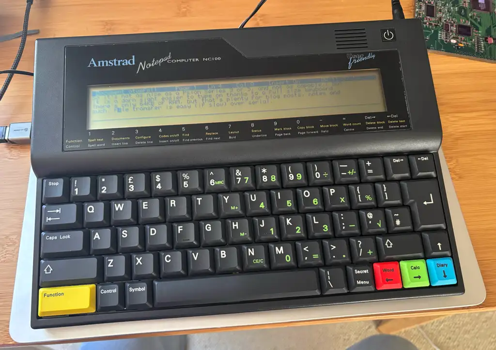
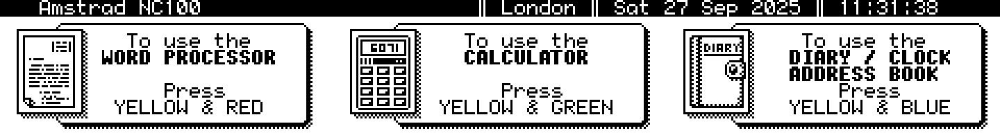
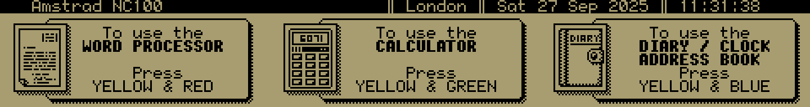

# Notepad2Bmp

Convert Amstrad NC100 Notepad screenshots to a more useful format: BMP. These can then be scaled in almost any modern graphics package and manipulated as required.



Also included is source code for a PCX conversion utility. Though modified by me, this was originally published in the 1993 book *The Amstrad Notepad Advanced User Guide*, produced by Sigma Press and written by Robin Nixon. The original code itself was written by Chris Nixon for Borland Turbo C running on DOS/Windows 3 machines. I have updated and commented Chris’ code. It is included here because it was the direct inspiration for `notepad2bmp`.

Originally called `NCPCX`, I have renamed the utility for consistency with the other NC100 file conversion utilities included in my GitHub account, such as [`notepad2text`](https://github.com/smittytone/Notepad2Text) — though of course you can name the binary whatever you like.

## Building

Navigate to the `source` directory and run

```shell
gcc -o notepad2bmp notepad2bmp.c
```

Copy the binary to a directory in your `$PATH`, eg.

```shell
sudo mv notepad2bmp /usr/local/bin
```

## Usage

Grab a screen on the NC100 using **Symbol**-**Shift**-**S**. This will save a file named `s.a` in memory. Note that the extension, but not the file name, changes with each new screenshot.

Copy the screenshot to your computer using XModem transfer, then run:

```shell
notepad2bmp s.a screenshot.bmp
```

**Note** A sample `s.a` file is included in the [`samples`](/samples) directory:



**Fun Tweak**

I've included in the code’s colour look-up data, pixel colouring for that old-fashioned LCD screen look:



Just comment out the `WHITE` line in the code, and uncomment the `LCD` line.

## Legal

This software copyright © 2025, Tony Smith (@smittytone). It is licensed under the terms of the [MIT Licence](LICENCE.md).
